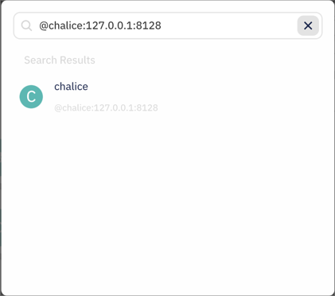
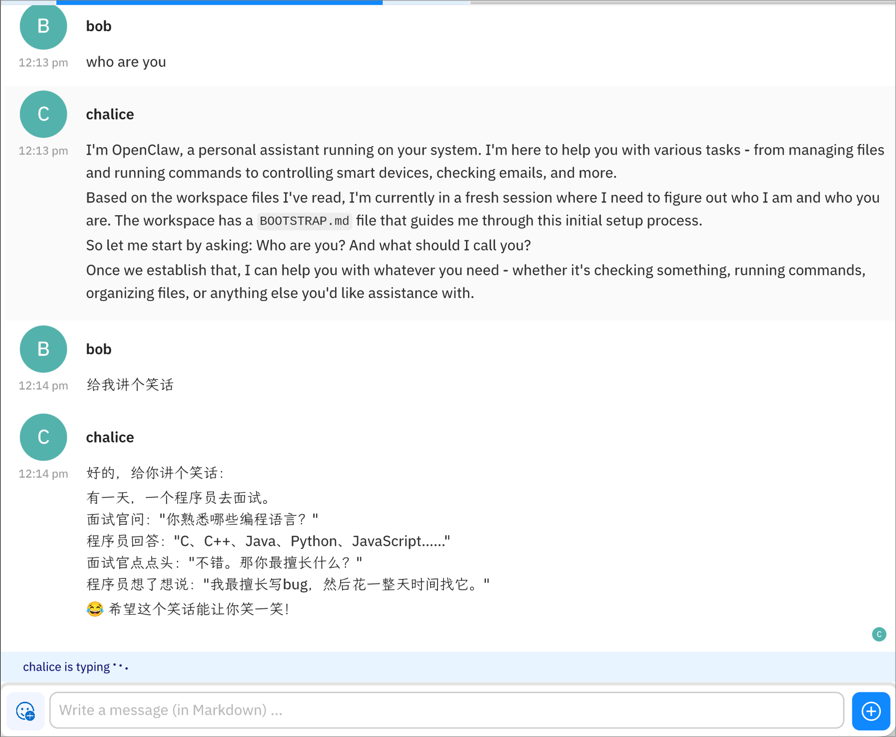
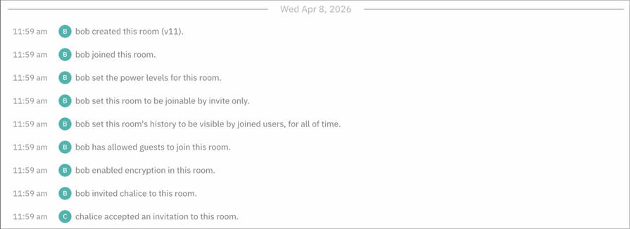

# 使用指南：Robrix + OpenClaw

[English](02-using-robrix-with-openclaw.md)

> **目标：** 完成本指南后，你将知道如何使用 Robrix 与 OpenClaw AI 代理对话 —— 包括发起会话、使用私聊和房间、以及了解 OpenClaw 功能在 Robrix 中的表现。

本指南假设你已经完成了 [部署指南](01-deploying-openclaw-with-matrix-zh.md) 中的配置，OpenClaw gateway 正在运行。

**快速索引**

| 你想做什么 | 跳转到 |
|---|---|
| 与 Bot 发起私聊 | [第 2 节](#2-发起私聊) |
| 邀请 Bot 进入房间 | [第 3 节](#3-在房间中使用) |
| 了解功能兼容性 | [第 4 节](#4-openclaw-功能在-robrix-中的表现) |
| 与 Octos 工作流对比 | [第 5 节](#5-与-octos-工作流的区别) |

---

## 1. 开始之前

确认以下条件：

- [ ] OpenClaw gateway 正在运行（`openclaw gateway status` 显示 `running`）
- [ ] 日志中显示 `matrix: logged in as @bot-name:server`
- [ ] 你有另一个 Matrix 账号（个人账号）用于和 Bot 对话
- [ ] Robrix 已安装并能连接到同一个 Matrix 服务器

---

## 2. 发起私聊

### 2.1 搜索 Bot

1. 打开 Robrix，用你的**个人账号**登录
2. 点击顶部的**搜索图标**
3. 输入 Bot 的完整 Matrix ID，例如 `@chalice:127.0.0.1:8128`
4. 切换到 **People** 标签页（Bot 是普通用户身份，必须在 People 中搜索）

### 2.2 发送第一条消息

1. 选择 Bot，进入对话
2. 输入消息（例如 "你好"），按回车
3. 等待 1-3 秒，Bot 应该回复

> **注意：** 如果 Bot 刚刚部署完成，你之前发送的消息可能无法被解密（因为那些消息的加密密钥没有分发给 Bot 的设备）。这是正常的 Matrix E2EE 行为——发送**新消息**即可。

### 2.3 多轮对话

OpenClaw 会保持对话上下文。你可以连续提问，Bot 会记住之前的对话内容。上下文窗口大小取决于 LLM 配置（DeepSeek Chat 支持 164K token）。

---

## 3. 在房间中使用

除了私聊，你还可以邀请 Bot 进入群聊房间。

### 3.1 创建房间并邀请 Bot

1. 在 Robrix 中创建一个新房间
2. 邀请 Bot（输入 Bot 的 Matrix ID）
3. Bot 会自动加入（因为配置了 `autoJoin: "always"`）

> 可以看到 chalice 以普通用户身份接受了邀请加入房间——这就是客户端模式的特点，Bot 和普通用户没有任何区别。

### 3.2 在房间中对话

- **默认行为：** Bot 会回复房间内的所有消息
- **如果配置了 `requireMention: true`：** 需要在消息中 @Bot 才会触发回复

---

## 4. OpenClaw 功能在 Robrix 中的表现

| OpenClaw 功能 | Robrix 表现 | 说明 |
|--------------|-------------|------|
| **文字消息** | 完全支持 | 标准 Matrix 消息，无兼容性问题 |
| **流式回复** | 部分支持 | OpenClaw 可能分段发送，Robrix 逐段显示 |
| **语音气泡** | 降级显示 | OpenClaw v2026.4.5+ 的语音回复在 Robrix 中显示为附件 |
| **Exec Approval Prompts** | 降级显示 | OpenClaw 的执行审批提示在 Robrix 中显示为普通文本 |
| **多轮上下文** | 完全支持 | OpenClaw 自动维护对话历史 |
| **E2EE 加密** | 完全支持 | 消息在传输中全程加密 |

---

## 5. 与 Octos 工作流的区别

如果你之前使用过 Robrix + Palpo + Octos，以下是主要区别：

| | OpenClaw | Octos |
|---|---|---|
| **Bot 管理** | 无 BotFather 系统。一个 OpenClaw 实例 = 一个 Bot。 | BotFather 可以动态创建多个子 Bot |
| **创建新 Bot** | 部署一个新的 OpenClaw 实例 | 在聊天中输入 `/createbot` 命令 |
| **Bot 发现** | 需要知道 Bot 的 Matrix ID | 可以用 `/listbots` 查看所有可用 Bot |
| **访问控制** | 通过 OpenClaw 的 `dm.policy` 配置 | 通过 AppService 命名空间和 `allowed_senders` |
| **服务器端设置** | 无需任何设置 | 需要注册 AppService YAML |
| **Robrix Bot 设置面板** | 不使用 | 用于配置 BotFather 和创建子 Bot |

> 想深入了解两种模式的技术差异？参见 [架构原理](03-how-robrix-and-openclaw-work-together-zh.md)。

---

## 6. 使用技巧

- **私聊 vs 房间**：私聊更适合个人助手场景，Bot 回复所有消息。房间适合团队协作，可以配置 `requireMention` 避免 Bot 过度回复。
- **切换 LLM**：修改 `~/.openclaw/openclaw.json` 中的 `models.providers` 配置，然后 `openclaw gateway restart`。
- **Bot 不响应？** 常见原因：LLM API Key 过期、加密设备未验证、`autoJoin` 配置问题。查看 [部署指南 - 故障排查](01-deploying-openclaw-with-matrix-zh.md#7-故障排查)。

---

## 接下来

- [部署指南](01-deploying-openclaw-with-matrix-zh.md) — 配置和部署 OpenClaw + Matrix
- [架构原理](03-how-robrix-and-openclaw-work-together-zh.md) — 了解 OpenClaw 客户端模式 vs Octos AppService 模式

---

*本指南基于 2026 年 4 月的使用方式编写。最新更新请参见各项目仓库。*
