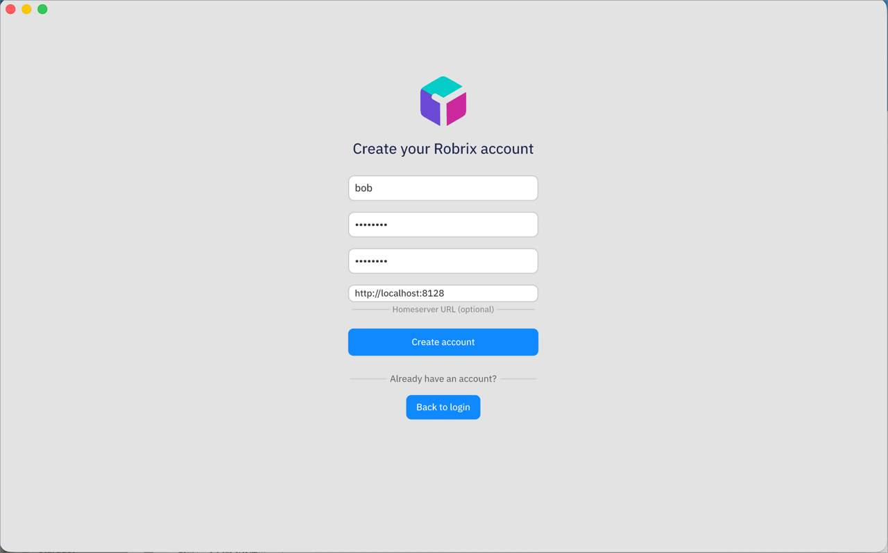
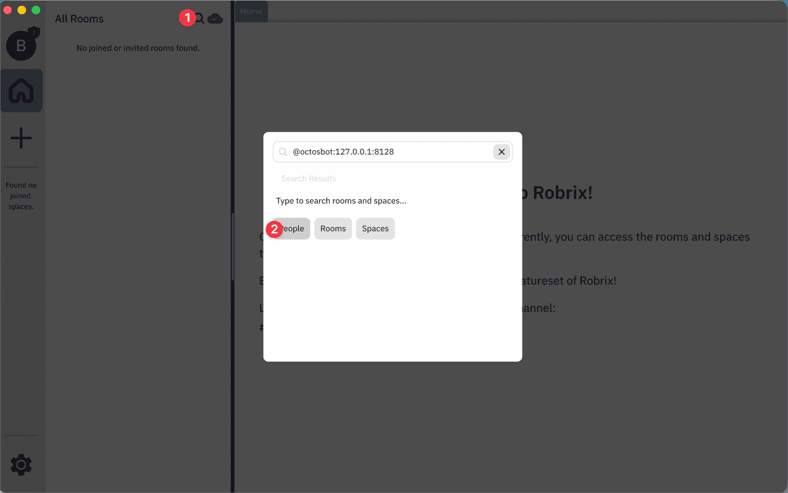

# 使用指南：Robrix + Palpo + Octos

[English Version](03-using-robrix-with-palpo-and-octos.md)

> **目标：** 按照本指南操作后，你将掌握如何使用 Robrix 连接 Palpo 服务器、注册账号、创建房间、邀请 AI 机器人、进行对话，以及通过 BotFather 系统管理机器人——全部配有分步截图演示。

本指南逐步介绍如何使用 Robrix 客户端连接 Palpo 服务器，并与 Octos AI 机器人进行对话。每个步骤都包含具体的操作说明。

**快速索引**

| 你想做什么                | 跳转到                            |
| ------------------------- | --------------------------------- |
| 连接到服务器              | [第 2 节](#2-连接到-palpo)           |
| 创建账号                  | [第 3 节](#3-注册账号)               |
| 与 AI 机器人聊天          | [第 5 节](#5-与-ai-机器人聊天)       |
| 创建专业化机器人          | [第 6 节](#6-机器人管理高级功能)     |
| 机器人命令与公开/私有设置 | [第 7 节](#7-octos-机器人命令与行为) |

---

## 1. 开始之前

请确认：

- **Palpo 和 Octos 已经启动并运行。** 请参照 [部署指南](01-deploying-palpo-and-octos-zh.md) 完成所有服务的搭建。
- **Robrix 已安装就绪。** 请参照 [快速入门](../robrix/getting-started-with-robrix-zh.md) 获取构建或下载说明。

> **注意：** 本指南假设使用本地部署，`server_name = 127.0.0.1:8128`。如果你使用远程部署，请将相关地址替换为你的实际服务器地址。

---

## 2. 连接到 Palpo

打开 Robrix 后会显示登录界面。默认情况下，Robrix 连接到 `matrix.org`。你需要将其指向你自己的 Palpo 服务器。

1. 在登录界面的 **底部** 找到 **Homeserver URL** 输入框。
2. 输入 `http://127.0.0.1:8128`（本地部署）。
3. 如果是远程服务器，输入 `https://your.server.name` 或 `http://服务器IP:8128`。


> **注意：** 如果 Homeserver URL 留空，Robrix 会默认连接到 `matrix.org`。你必须填写此字段才能连接到自己的 Palpo 服务器。

---

## 3. 注册账号

在 Palpo 服务器上创建新账号：

1. 输入你想要的 **用户名**（例如 `alice`）。
2. 输入 **密码**。
3. 在 **确认密码** 字段再次输入相同的密码。
4. 输入 **Homeserver URL**：`http://127.0.0.1:8128`。
5. 点击 **Sign up（注册）**。



> **注意：** 服务器必须启用注册功能。请确保 `palpo.toml` 中设置了 `allow_registration = true`。详见 [部署指南 -- 配置部分](01-deploying-palpo-and-octos-zh.md)。

---

## 4. 登录

如果你已有账号：

1. 输入 **用户名** 和 **密码**。
2. 输入 **Homeserver URL**：`http://127.0.0.1:8128`
3. 点击 **Log in（登录）**。

登录后会看到房间列表。新账号的房间列表是空的。

<!-- screenshot: room-list-empty.png — 首次登录后的空房间列表 -->

---

## 5. 与 AI 机器人聊天

这是主要的使用流程：创建房间、邀请机器人、开始对话。

### 5.1 创建新房间

1. 点击房间列表区域的 **创建房间** 按钮（"+" 图标）。
2. 为房间命名，例如 "AI Chat"。
3. 房间创建完成，你会自动进入该房间。

<!-- screenshot: create-room.png — 创建房间对话框，已输入房间名称 -->

### 5.2 邀请机器人

1. 点击房间列表顶部的 **搜索图标**（下图中的 **①**）。
2. 在搜索对话框中输入机器人的完整 Matrix ID：`@octosbot:127.0.0.1:8128`。
3. 点击 **People** 标签页（**②**），将搜索结果过滤为用户和机器人（而非 Rooms 或 Spaces）。
4. 从搜索结果中选择机器人，即可开始直接对话或邀请它加入房间。
5. 机器人会自动加入。这是通过 Application Service 机制实现的，不需要在机器人端手动接受邀请。



> **这个机器人名字是怎么来的？** BotFather 的 Matrix ID 由两个配置值组合而成：
>
> | 组成部分                 | 值                                     | 配置位置                                                                    |
> | ------------------------ | -------------------------------------- | --------------------------------------------------------------------------- |
> | 用户名（localpart）      | `octosbot`                           | `octos-registration.yaml` 和 `botfather.json` 中的 `sender_localpart` |
> | 服务器域名               | `127.0.0.1:8128`                     | `palpo.toml` 中的 `server_name`                                         |
> | **完整 Matrix ID** | **`@octosbot:127.0.0.1:8128`** |                                                                             |
> | 显示名称（房间内显示）   | `BotFather`                          | `botfather.json` 中的 `name`                                            |
>
> 通过 `/createbot` 创建的子机器人遵循类似规则。`botfather.json` 中的 `user_prefix` 字段（默认值：`octosbot_`）会自动拼接在你指定的用户名前面：
>
> `/createbot weather Weather Bot` → Matrix ID：`@octosbot_weather:127.0.0.1:8128`
>
> 如果你在生产环境中更改了 `server_name`，所有机器人 ID 都会随之改变。你还需要同步更新 `octos-registration.yaml` 中的命名空间正则表达式。

### 5.3 开始聊天

1. 在房间底部的输入框中输入消息。
2. 按 **Enter** 或点击 **发送**。
3. 机器人通过配置的 LLM 处理你的消息并回复。
4. 你会看到流式动画效果，回复内容会实时逐步显示。

<!-- screenshot: bot-conversation.png — 对话界面，显示用户消息和机器人的 AI 回复 -->

> 机器人的响应时间取决于 LLM 提供商和模型。DeepSeek 通常在几秒内响应，较大的模型可能需要更长时间。

**对话示例：**

```
你：    什么是 Matrix 协议？
机器人：Matrix 是一个去中心化实时通信的开放标准。它提供 HTTP API
       用于创建和管理聊天室、发送消息以及在联邦服务器之间同步状态……
```

### 5.4 替代方式：加入已有的机器人房间

如果其他人已经创建了包含机器人的房间并邀请了你，或者存在公开房间：

1. 点击 **加入房间**。
2. 输入房间别名（例如 `#ai-chat:127.0.0.1:8128`）或房间 ID。
3. 即可直接与机器人聊天。

<!-- screenshot: join-room.png — 加入房间对话框，已输入房间别名 -->

---

## 6. 机器人管理（高级功能）

Octos 支持"BotFather"模式：主机器人（`@octosbot`）可以创建**子机器人**，每个子机器人拥有自己的个性和系统提示词。这对于构建专业化的 AI 助手非常有用。

如需深入了解其工作原理，请参阅 [架构指南](02-how-robrix-palpo-octos-work-together-zh.md)。

### 6.1 在 Robrix 中启用 App Service 支持

在管理机器人之前，需要先在 Robrix 中启用该功能：

1. 打开 Robrix 的 **设置**（齿轮图标）。
2. 导航到 **Bot Settings（机器人设置）**。
3. 将 **Enable App Service** 开关打开。
4. 输入 **BotFather User ID**：`@octosbot:127.0.0.1:8128`。
5. 点击 **Save（保存）**。

<!-- screenshot: bot-settings.png — Robrix 设置中的 Bot Settings 面板，Enable App Service 已开启，BotFather User ID 已填写 -->

### 6.2 创建子机器人

启用 BotFather 后，你可以创建专业化的子机器人：

1. 从机器人管理面板打开 **Create Bot（创建机器人）** 对话框。
2. 填写以下字段：
   - **Username（用户名）** -- 仅限小写字母、数字和下划线（例如 `translator_bot`）。
   - **Display Name（显示名称）** -- 在房间中显示的名称（例如 "翻译机器人"）。
   - **System Prompt（系统提示词）** -- 定义机器人行为的指令。示例：
     - `"你是一个翻译助手。将所有消息翻译成中文。"`
     - `"你是一个编程助手。帮助用户编写和调试代码。"`
     - `"你是一个写作教练。检查文本的清晰度和语法。"`
3. 点击 **Create Bot（创建机器人）**。

子机器人会以 `@octosbot_<用户名>:127.0.0.1:8128` 的格式注册。以上面的例子为例，ID 为 `@octosbot_translator_bot:127.0.0.1:8128`。

<!-- screenshot: create-bot-dialog.png — 创建机器人对话框，已填写用户名、显示名称和系统提示词 -->

### 6.3 使用子机器人

创建子机器人后，使用方式与主机器人相同：

1. 创建新房间或使用已有房间。
2. 通过完整的 Matrix ID 邀请子机器人（例如 `@octosbot_translator_bot:127.0.0.1:8128`）。
3. 与它对话。机器人会按照你定义的系统提示词来响应。

<!-- screenshot: child-bot-conversation.png — 与专业化子机器人的对话，机器人遵循其系统提示词 -->

---

## 7. Octos 机器人命令与行为

Octos 机器人支持在聊天房间中直接输入少量斜杠命令。本节只保留最主要的 BotFather 管理命令，以及子机器人的公开/私有可见性说明。

### 7.1 BotFather 管理命令

这些命令只对 BotFather 机器人（`@octosbot`）有效，子机器人不会响应。

| 命令                                    | 说明                                                                                           | 示例                                                                               |
| --------------------------------------- | ---------------------------------------------------------------------------------------------- | ---------------------------------------------------------------------------------- |
| `/createbot <用户名> <显示名> [选项]` | 创建子机器人。选项：`--public` 或 `--private`（默认），`--prompt "..."` 设置系统提示词。 | `/createbot weather Weather Bot --public --prompt "You are a weather assistant"` |
| `/deletebot <Matrix 用户 ID>`         | 删除子机器人。只有创建者（或管理员）可以删除。                                                 | `/deletebot @octosbot_weather:127.0.0.1:8128`                                    |
| `/listbots`                           | 列出所有公开机器人以及你自己创建的私有机器人。                                                 | `/listbots`                                                                      |
| `/bothelp`                            | 显示机器人管理命令的帮助信息。                                                                 | `/bothelp`                                                                       |

> **注意：** 你也可以通过 Robrix 的 UI 创建机器人（第 6.2 节），它提供了表单形式的替代方案。

### 7.2 BotFather 与子机器人的区别

BotFather 和子机器人的角色不同：

|                              | BotFather（`@octosbot`）                            | 子机器人（`@octosbot_<名称>`）   |
| ---------------------------- | ----------------------------------------------------- | ---------------------------------- |
| **角色**               | 管理入口 + 通用 AI 聊天                               | 专业化 AI 助手                     |
| **管理命令**           | 支持（`/createbot`、`/deletebot`、`/listbots`） | 不支持                             |
| **自定义系统提示词**   | 使用默认提示词                                        | 拥有独立的专用提示词               |
| **能否创建其他机器人** | 能                                                    | 不能                               |
| **Matrix 用户 ID**     | `@octosbot:server_name`                             | `@octosbot_<用户名>:server_name` |

**何时使用哪个：**

- 使用 **BotFather** 进行通用 AI 对话，以及管理（创建/删除）其他机器人。
- 使用**子机器人**来完成特定任务（翻译、编程辅助、文字审阅等），它们拥有固定的系统提示词。

### 7.3 公开与私有机器人

创建子机器人时，你可以设置其**可见性**：

- **私有（默认）：** 只有创建者可以邀请和使用此机器人。其他用户通过 `/listbots` 看不到它，如果尝试邀请它，机器人会短暂加入房间、发送拒绝消息，然后离开。
- **公开：** 服务器上的任何用户都可以通过 `/listbots` 发现此机器人，将其邀请到房间并与之对话。

**创建私有机器人（默认）：**

```
/createbot myhelper My Helper --prompt "You are my personal assistant"
```

**创建公开机器人：**

```
/createbot translator Translator Bot --public --prompt "Translate all messages to English"
```

**谁可以删除机器人：**

- 机器人的**创建者**（所有者）可以随时删除它。
- **管理员**（`botfather.json` 中 `allowed_senders` 列表中的用户）可以删除任何机器人，作为紧急覆盖权限。

> **提示：** 建议先创建私有机器人供个人使用。只在你想让服务器上其他用户也能使用时，才将机器人设为公开。

---

## 8. 使用技巧

- **在一个房间中使用多个机器人。** 你可以在同一个房间中邀请多个机器人，每个机器人根据自己的系统提示词独立响应。这对于对比不同模型的输出或构建多智能体工作流很有用。
- **私密对话。** 创建一个私密房间，只邀请一个机器人，进行不受其他用户或机器人干扰的一对一聊天。
- **更换 LLM 提供商。** LLM 后端在 `botfather.json` 中配置（或通过环境变量设置）。你可以在 DeepSeek、OpenAI、Anthropic 等提供商之间切换。详见 [部署指南 -- 配置部分](01-deploying-palpo-and-octos-zh.md)。
- **机器人没有响应？** 常见原因：

  - Octos 服务未运行。
  - LLM API 密钥缺失或无效。
  - 机器人未被正确邀请到房间。
  - 请查看部署指南中的 [故障排查部分](01-deploying-palpo-and-octos-zh.md#5-故障排除)。
- **Server name 不匹配。** 所有 Matrix ID（用户、机器人、房间）必须使用与 Palpo 配置相同的 `server_name`。如果机器人 ID 与服务器名称不匹配，邀请会失败。

---

## 9. 常用 Matrix ID 参考

本地部署（`server_name = 127.0.0.1:8128`）下的常用 ID：

| 项目                       | Matrix ID                                   |
| -------------------------- | ------------------------------------------- |
| 你的用户账号               | `@你的用户名:127.0.0.1:8128`              |
| 主 AI 机器人（BotFather）  | `@octosbot:127.0.0.1:8128`                |
| 子机器人（例如翻译机器人） | `@octosbot_translator_bot:127.0.0.1:8128` |
| 房间别名                   | `#房间名:127.0.0.1:8128`                  |

远程部署时，将 `127.0.0.1:8128` 替换为你配置的 `server_name`。

---

## 接下来

- [部署指南](01-deploying-palpo-and-octos-zh.md) -- 搭建和配置服务
- [架构指南](02-how-robrix-palpo-octos-work-together-zh.md) -- 了解各组件如何协同工作
