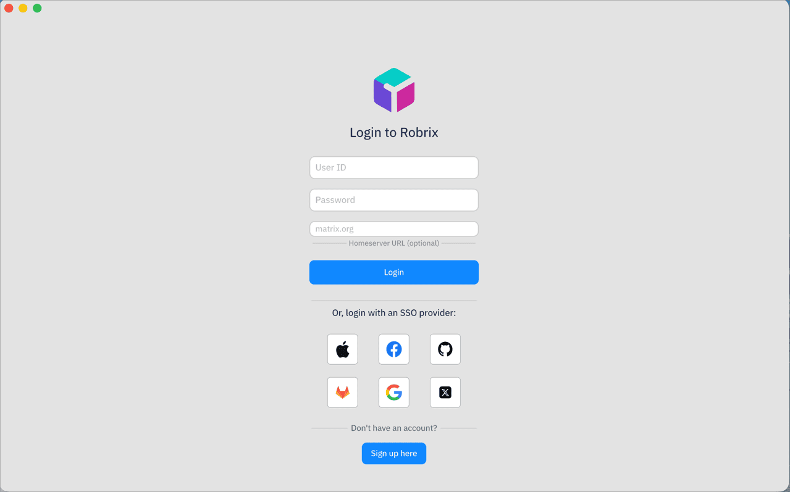

# Getting Started with Robrix

[中文版](getting-started-with-robrix-zh.md)

> **Goal:** After following this guide, you will have Robrix installed and running, connected to a Matrix server, and ready to chat.

Robrix is a cross-platform Matrix chat client written in Rust using the [Makepad](https://github.com/makepad/makepad/) UI framework. It runs natively on macOS, Linux, Windows, Android, and iOS.

---

## Download a Pre-built Release (Recommended)

Download the latest version from the [Robrix Releases page](https://github.com/Project-Robius-China/robrix2/releases). Available for macOS, Linux, and Windows.

## Build from Source

### Prerequisites

- [Rust](https://www.rust-lang.org/tools/install) (latest stable)
- On Linux, install system dependencies:
  ```bash
  sudo apt-get install libssl-dev libsqlite3-dev pkg-config libxcursor-dev libx11-dev libasound2-dev libpulse-dev libwayland-dev libxkbcommon-dev
  ```

### Desktop (macOS / Linux / Windows)

```bash
git clone https://github.com/Project-Robius-China/robrix2.git
cd robrix2
cargo run --release
```

### Mobile

For Android and iOS builds, see the [Robrix README — Building & Running](https://github.com/Project-Robius-China/robrix2#building--running-robrix-on-desktop).

---

## Connect to a Matrix Server

When you launch Robrix, you'll see the login screen with a **Homeserver URL** field at the bottom.



- **Leave it empty** to connect to `matrix.org` (the default public server)
- **Enter a custom URL** to connect to any Matrix-compatible server:
  - Local Palpo instance: `http://127.0.0.1:8128`
  - Remote server: `https://your.server.name`

> **Note:** Robrix requires the homeserver to support [Sliding Sync](https://spec.matrix.org/latest/client-server-api/#sliding-sync). Palpo supports this natively; for other servers, check their documentation.

## Register or Log In

**New account (if the server allows registration):**

1. Enter a **username** and **password**
2. Confirm the password
3. Set the **Homeserver URL**
4. Click **Sign up**

**Existing account:**

1. Enter your **username** and **password**
2. Set the **Homeserver URL**
3. Click **Log in**

After login, you'll see your room list. From here you can join rooms, create new rooms, and start chatting.

---

## What's Next?

- **Just chatting?** You're all set — join rooms and talk to people on the Matrix network.
- **Want AI bots?** See the [Robrix + Palpo + Octos deployment guide](../robrix-with-palpo-and-octos/01-deploying-palpo-and-octos.md) to set up your own AI chat system.
